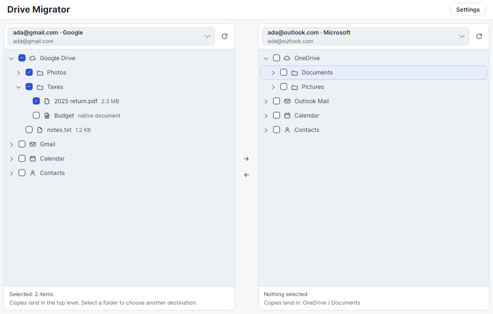
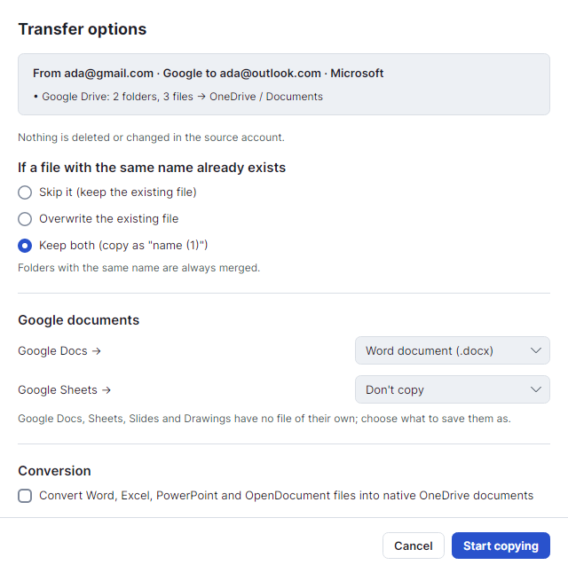
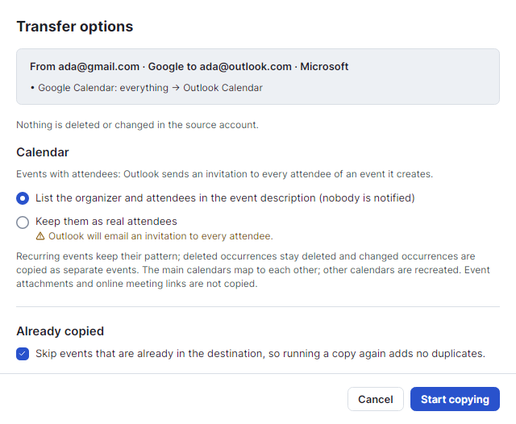
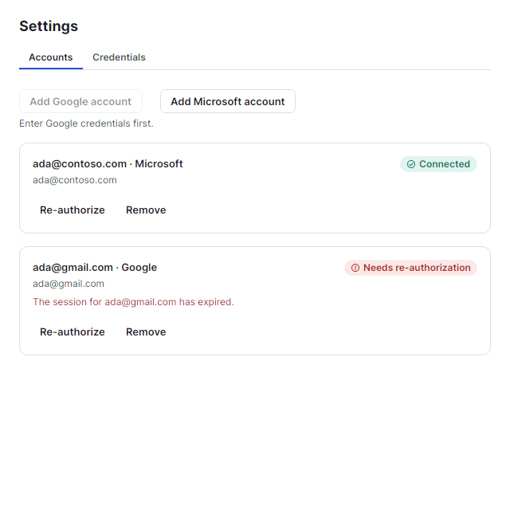
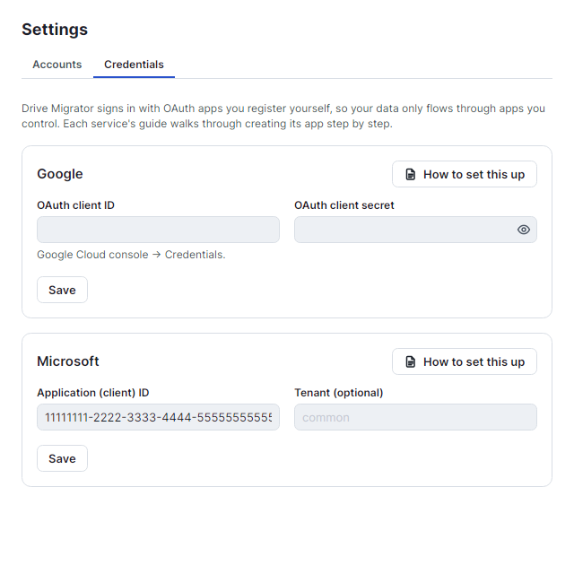
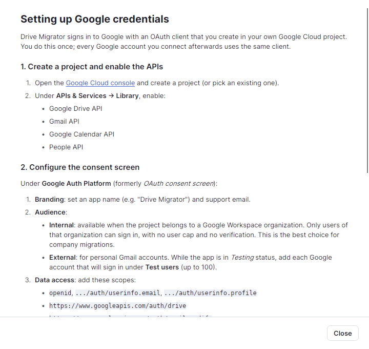
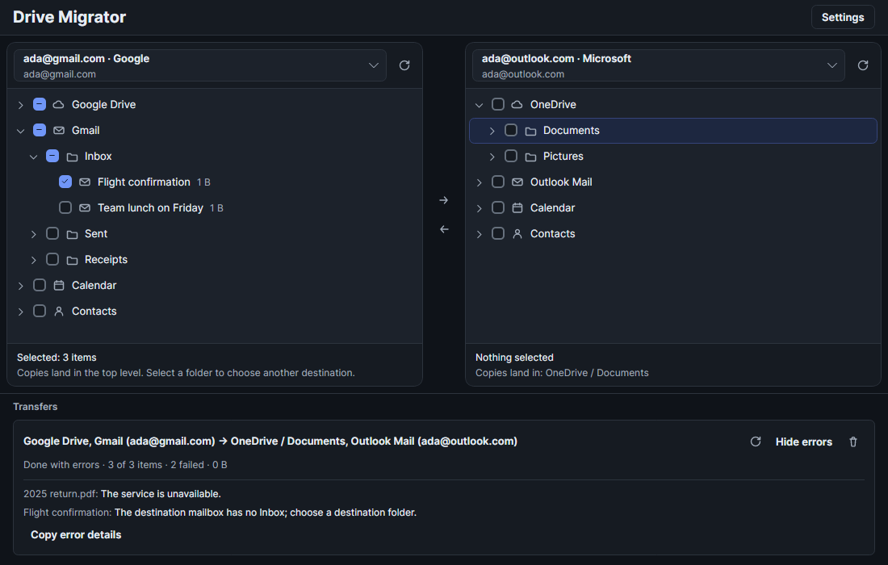
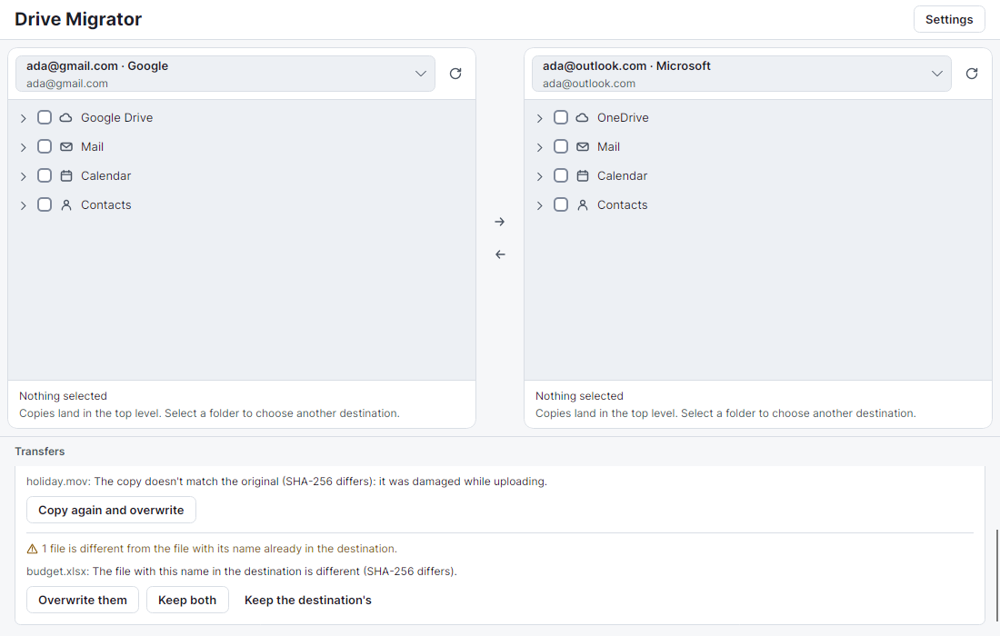

# Drive Migrator

A cross-platform desktop app (Windows, Linux, macOS) for migrating data between cloud services —
currently Google (Drive, Gmail, Calendar, Contacts) and Microsoft (OneDrive, Outlook Mail, Calendar,
Contacts; personal and work/school accounts). Built with .NET 10 and Avalonia.



## Features

- **Two panes, any direction.** Pick an account on each side, check what to copy, select a destination folder,
  and press an arrow. Copies never delete or change anything in the source account.
- **Drive, mail, calendar and contacts.** Files and folders, mail folders and messages, calendars with recurring
  events, and contacts all move through the same tree.
- **Per-job options.** Choose how name conflicts are handled, what Google Docs/Sheets/Slides become, whether
  Office files are converted to native documents, and whether calendar attendees get invitations.
- **Checksum verification.** Every copied file is checked against the checksums both services report (SHA-256,
  SHA-1 or MD5 on Google Drive, QuickXorHash, SHA-1 or SHA-256 on OneDrive, whichever both sides have). A copy
  that doesn't match fails and is listed with a one-click "copy again and overwrite". With "Skip it" for name
  conflicts, files already in the destination can also be compared with the source instead of just skipped;
  identical ones are skipped, and different ones are listed for you to overwrite, keep both, or leave.
- **Resumable transfers.** Jobs are stored locally, survive restarts, can be paused and retried, and list every
  failed item with its full error.
- **Your own OAuth apps.** Sign-ins go through clients you register, and tokens stay in the OS credential store.
  Step-by-step setup guides for Google and Microsoft are built into the app, one click from **Settings → Credentials**.
- **Light and dark themes.**

<table>
  <tr>
    <td></td>
    <td></td>
  </tr>
  <tr>
    <td></td>
    <td></td>
  </tr>
  <tr>
    <td colspan="2"></td>
  </tr>
</table>





### Checksum limits

- Google Docs, Sheets, Slides and Drawings have no checksum, and neither do files converted into them, so they
  are copied unchecked. Exported documents are still checked against what the destination stored.
- OneDrive can take a moment to compute a new file's checksums; the copy is looked up once more, and if the
  checksum still isn't there, the file counts as copied unchecked.
- OneDrive for Business and SharePoint may rewrite Office files (.docx, .xlsx, .pptx) after an upload, e.g. to add
  metadata, which changes their checksum. Such a copy can be reported as not matching even though it arrived
  intact. If that happens, turn off "Check each copy" for those files.

## Layout

| Path | Purpose |
|---|---|
| `src/DriveMigrator.Core` | Provider-neutral abstractions: providers, accounts, capabilities, node tree, payload models. No cloud SDK dependencies. |
| `src/DriveMigrator.Engine` | Transfer engine: SQLite-backed, resumable jobs with parallel workers, conflict handling and checksum verification. |
| `src/DriveMigrator.Infrastructure` | Local persistence: OS keychain secret store (DPAPI / macOS Keychain / libsecret), account list. |
| `src/DriveMigrator.Providers.Google` | Google provider (sign-in via Google.Apis.Auth; APIs added per capability). |
| `src/DriveMigrator.Providers.Microsoft` | Microsoft provider (sign-in via MSAL, personal and work/school accounts). |
| `src/DriveMigrator.App` | Avalonia desktop app (MVVM with CommunityToolkit.Mvvm, DI via Microsoft.Extensions.Hosting). |
| `tests/DriveMigrator.Testing` | `FakeCloudProvider` and in-memory stores for tests and UI development. |
| `tests/*.Tests` | Unit tests, plus headless Avalonia UI tests in `DriveMigrator.App.Tests`. |

## Architecture in brief

- An `ICloudProvider` (one per service) signs accounts in and hands back an `IAccountSession`.
- A session exposes capabilities: `IDriveCapability`, `IMailCapability`, `ICalendarCapability`, `IContactsCapability`.
- Every capability shares one browsing contract (`GetChildrenAsync`, `CreateContainerAsync`, `FindChildAsync`)
  over `MigrationNode`s, so the UI renders any of them as a tree.
- Data moves through neutral formats — file streams, raw MIME for mail, and `CalendarEvent` / `Contact`
  records — so the engine pairs any reader with any writer without provider-to-provider code.
- New services plug in with `services.AddCloudProvider<TProvider>()`.
- The transfer engine stores every job and item in `transfers.db`, creates folders before their contents and
  discovers contents as it goes, so jobs can be paused, survive restarts, and resume without re-copying.
- `AccountManager` restores, adds, re-authorizes and removes accounts. Tokens live in the OS credential store;
  only the account list (no secrets) is written to `accounts.json` in the app data directory.

## Credentials

Drive Migrator doesn't ship with OAuth clients. You register your own and enter them in **Settings → Credentials**,
where **How to set this up** opens each service's guide in the app. The same guides are here:

- [Google setup](docs/setup-google.md)
- [Microsoft setup](docs/setup-microsoft.md)

## Build and run

Requires the .NET 10 SDK (pinned in `global.json`).

```bash
dotnet build DriveMigrator.slnx
dotnet test DriveMigrator.slnx
dotnet run --project src/DriveMigrator.App
```

Set `DRIVEMIGRATOR_DATA_DIR` to use a separate data directory (handy during development). Set
`DRIVEMIGRATOR_SCREENSHOTS` to a directory when running the tests to save rendered window images there.

The screenshots in this README come from those headless renders (fake accounts, no network):

```bash
DRIVEMIGRATOR_SCREENSHOTS=/tmp/drive-migrator-shots dotnet test tests/DriveMigrator.App.Tests
```

Copy the frames you want from `/tmp/drive-migrator-shots/` over the ones in `docs/screenshots/`.
